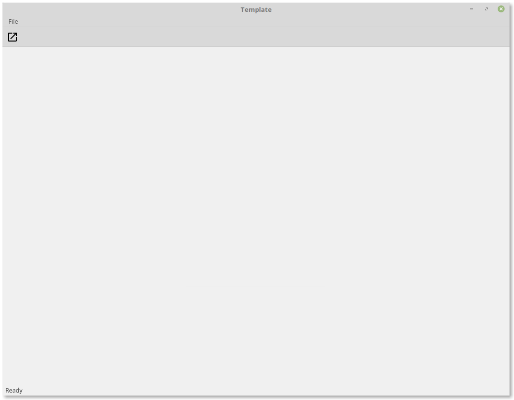

.. image:: images/header.png

.. image:: https://travis-ci.org/mandeep/cookiecutter-pyqt5.svg?branch=master
    :target: https://travis-ci.org/mandeep/cookiecutter-pyqt5

Cookiecutter-PyQt5 is a Cookiecutter_ template that assists users in their creation of GUI applications.

.. _Cookiecutter: https://github.com/audreyr/cookiecutter

Features
--------

* GUI application template
* Package creation with ready-made setup.py
* Continuous integration with pre-built .travis.yml for Travis CI
* Pre-assembled Pytest test suite with inclusion of pytest-qt and pytest-xvfb to enhance test experience

Installation
------------

Prior to installing the PyQt5 cookiecutter, the cookiecutter package must be installed in the user's virtual environment. This is achieved via the following command::

    $ pip install cookiecutter

With cookiecutter installed, the PyQt5 cookiecutter template can be installed with::

    $ cookiecutter https://github.com/mandeepbhutani/cookiecutter-pyqt5.git

Once cookiecutter clones the template, the user will be asked a series of questions related to their
project::

    $ full_name [Mandeep]: Enter your full name.

    $ email [info@mandeep.xyz]: Enter your email address.

    $ github_username [mandeep]: Enter your github username.

    $ repo_name [cookiecutter-pyqt5]: Enter the name of your project's repository.

    $ package_name [cookiecutter-pyqt5]: Enter the name of your application's package.

    $ application_name [application]: Enter the name of your GUI application.

    $ application_title [Template]: Enter the title of your application. This name is also used
      as an entry point into the application.

    $ project_short_description [A PyQt5 GUI application]: Enter a short description about your project.

    $ version [0.0.1]: Enter the version number for your application.

    $ insert_toolbar [yes]: If you would like a tool bar on your application, press enter or type yes.

    $ insert_statusbar [yes]: If you would like a movable status bar on your application, press enter or type yes.

Usage
-------

With the questions during installation answered, the user will have a fully functioning Python project
in their current working directory. This package will contain a GUI application template in the package
directory as well as a test suite in the package's tests folder. All the user needs to finish coding is the rest of their GUI application and related tests.

Screenshot
-----------

The Qt library creates applications native to the desktop environment of the user's operating system. Below is a screenshot of the template application opened on Linux Mint 18 Cinnamon.

